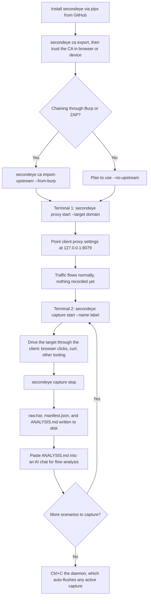
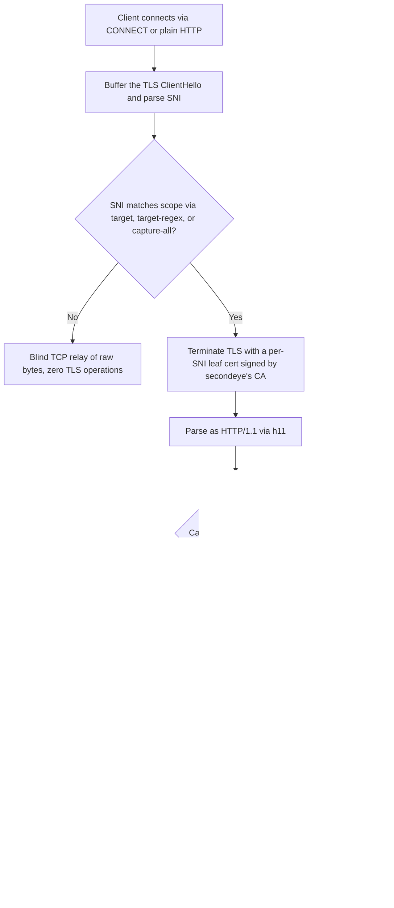

# Architecture and flow

Two views of `secondeye`: the operator's end-to-end workflow, and the
per-connection scope decision the daemon makes internally. See the main
[README](../README.md) for full command usage.

## Operator workflow

## Per-connection scope decision

